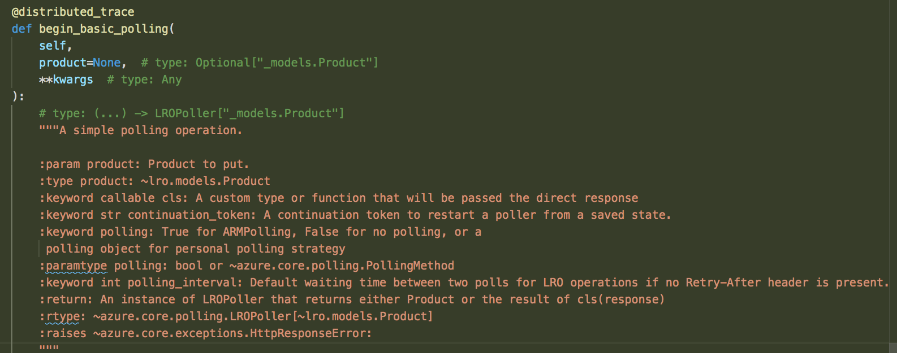
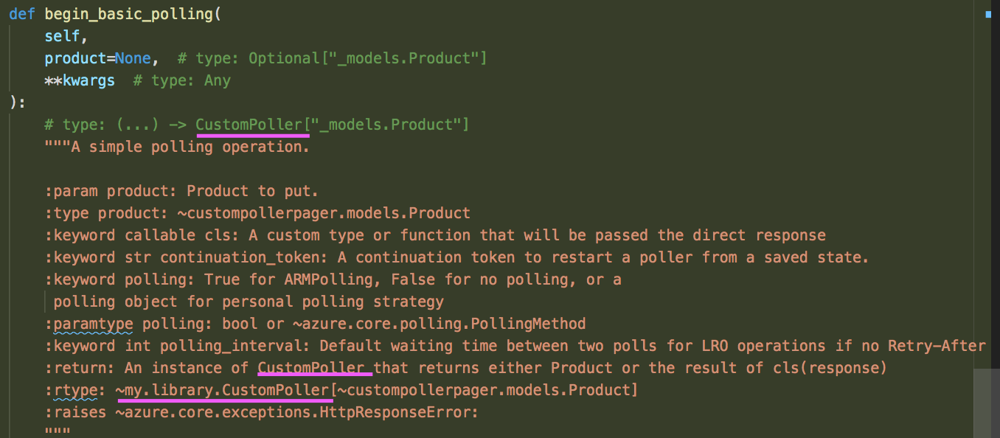
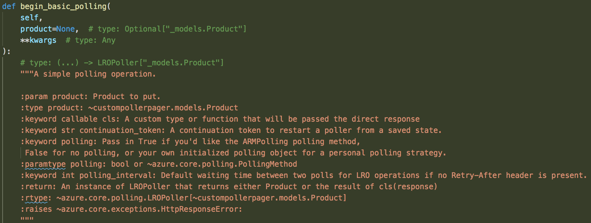
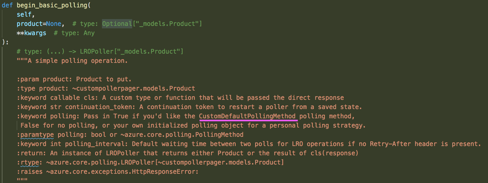
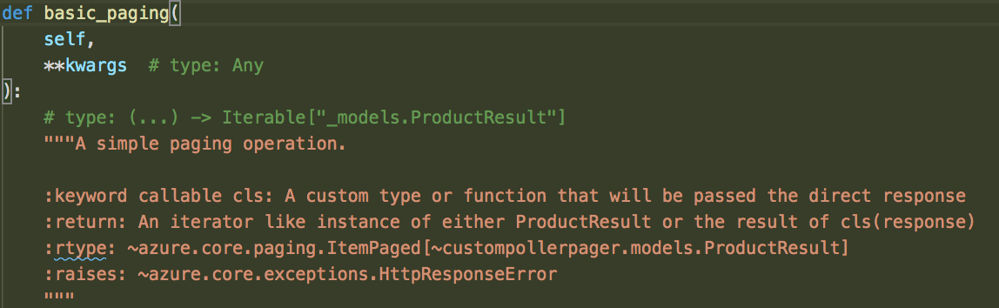
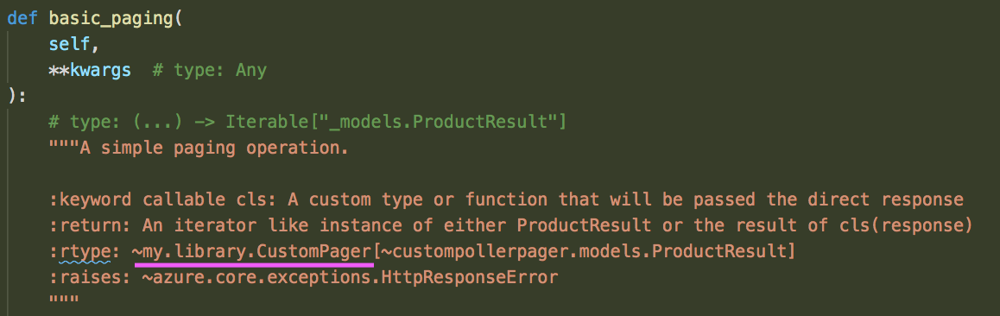
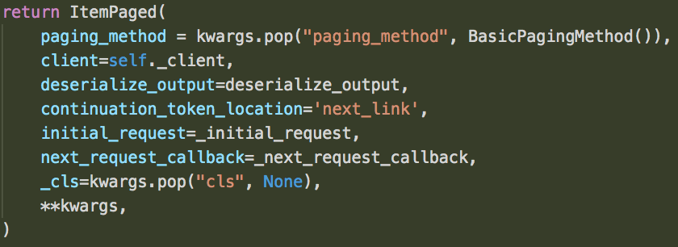
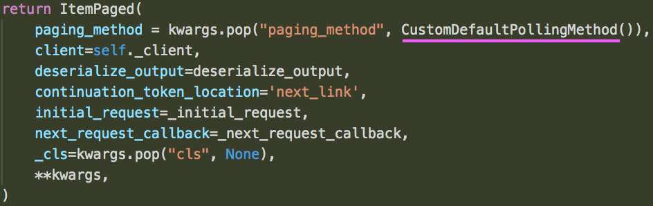

#   Python-Specific Directives

If you want to see how to generally use a directive to change AutoRest behavior, check out the [main docs](https://github.com/Azure/autorest/tree/master/docs/generate/directives.md). This section will go into the Python-specific directives.

These directives all start out with this general skeleton of a directive:

````
```yaml
directive:
    from: swagger-document
    where: ...
    transform: ...
```
````

Additionally, they all require you to specify which operation you would like to modify. You refer to operation using it's path in the swagger, and the HTTP verb it's listed under.
So, if you were modifying the `put` operation under the path `/directives/polling`, your `where` part of the directive would look like `where: '$.paths["/directives/polling"].put'`

Where they differ is in the conditions your custom objects need to fulfill, how you mark the directive, and how they change the generated code.

The following scenarios all use the [directives.json][directives_swagger] example swagger.


* [Generate with a Custom Poller](#generate-with-a-custom-poller "Generate with a Custom Poller")
* [Generate with a Custom Default Polling Method](#generate-with-a-custom-default-polling-method "Generate with a Custom Default Polling Method")
* [Generate with a Custom Pager](#generate-with-a-custom-pager "Generate with a Custom Pager")
* [Generate with a Custom Paging Method](#generate-with-a-custom-paging-method "Generate with a Custom Paging Method")

## Generate with a Custom Poller

By default, a long running operation will generate with poller [`LROPoller`][lro_poller_docs] from [azure-core][azure_core_pypi]'s polling library (the async version being [`AsyncLROPoller`][async_lro_poller_docs]). With this directive, you can change the generated code to generate with your custom poller.

### Custom Poller Conditions

1. It must take in a `Generic` of the final response object type, i.e. its definition should look like `class CustomPoller(Generic[PollingReturnType]):`
2. The initialization parameters must be the same as [`LROPoller`][lro_poller_docs]'s
3. If you want continuation token support on your poller, you need to implement class method `from_continuation_token` with the same method signature as [`LROPoller`][lro_poller_docs]'s

We will be modifying the long running operation in the [example swagger][directives_swagger], so the `where` in our directive will be `where: '$.paths["/directives/polling"].put'`

We use `$["x-python-custom-poller-sync"]` and `$["x-python-custom-poller-async"]` to specify our sync and async custom pollers. You have to use the full import path of the custom poller you're specifying, i.e. `my.library.CustomPoller`. Putting this altogether, we get the following directive, which we will insert in our config file.

```yaml
directive:
    from: swagger-document
    where: '$.paths["/directives/polling"].put'
    transform: >
        $["x-python-custom-poller-sync"] = "my.library.CustomPoller";
        $["x-python-custom-poller-async"] = "my.library.aio.AsyncCustomPoller"
```

To illustrate the generated code difference, here is the before and after of typing and docstrings. Not including the full code for the sake of room.

**Without directive:**
# 

**With directive:**
# 


## Generate with a Custom Default Polling Method

By default, a long running operation will generate with default polling method [`LROBasePolling`][lro_base_polling_docs], or [`ARMPolling`][arm_polling_docs] in `azure-arm` mode (the async versions being [`AsyncLROBasePolling`][async_lro_base_polling_docs] and [`AsyncARMPolling`][async_arm_polling_docs]). With this directive, you can change the generated code to generate with your custom default polling method.

You can also pass in a polling method through `kwargs` to each operation. Use this directive if you want the generated code to generate with your custom default polling method, instead of passing in your custom polling method to the generated code.

### Custom Default Polling Method Conditions

1. It must implement the abstract base class for [`PollingMethod`][polling_method_docs] (async [`AsyncPollingMethod` docs here][async_polling_method_docs]). You can also inherit from one of our existing polling method implementations, for example [`LROBasePolling`][lro_base_polling_docs], and modify as needed.

We use `$["x-python-custom-default-polling-method-sync"]` and `$["x-python-custom-default-polling-method-async"]` to specify our sync and async custom default polling methods. You have to use the full import path of the custom default polling method you're specifying, i.e. `my.library.CustomDefaultPollingMethod`. Putting this altogether, we get the following directive, which we will insert in our config file.

```yaml
directive:
    from: swagger-document
    where: '$.paths["/directives/polling"].put'
    transform: >
        $["x-python-custom-default-polling-method-sync"] = "my.library.CustomDefaultPollingMethod";
        $["x-python-custom-default-polling-method-async"] = "my.library.aio.AsyncCustomDefaultPollingMethod"
```

To illustrate the generated code difference, here is the before and after of typing and docstrings. Not including the full code for the sake of room.

**Without directive:**
# 

**With directive:**
# 

## Generate with a Custom Pager

By default, a paging operation will generate with pager [`ItemPaged`][item_paged_docs] from [azure-core][azure_core_pypi]'s polling library (the async version being [`AsyncItemPaged`][async_item_paged_docs]). With this directive, you can change the generated code to generate with your custom pager.

### Custom Pager Conditions

1. Your custom pager must have the same initialization parameters as [`ItemPaged`][item_paged_docs]

We will be modifying the paging operation in the [example swagger][directives_swagger], so the `where` in our directive will be `where: '$.paths["/directives/paging"].get'`

We use `$["x-python-custom-pager-sync"]` and `$["x-python-custom-pager-async"]` to specify our sync and async custom pagers. You have to use the full import path of the custom pager you're specifying, i.e. `my.library.CustomPager`. Putting this altogether, we get the following directive, which we will insert in our config file.

```yaml
directive:
    from: swagger-document
    where: '$.paths["/directives/paging"].get'
    transform: >
        $["x-python-custom-pager-sync"] = "my.library.CustomPager";
        $["x-python-custom-pager-async"] = "my.library.aio.AsyncCustomPager"
```

To illustrate the generated code difference, here is the before and after of typing and docstrings. Not including the full code for the sake of room.

**Without directive:**
# 

**With directive:**
# 

## Generate with a Custom Default Paging Method

By default, a long running operation will generate with default sans I/O paging method `BasicPagingMethod`. With this directive, you can change the generated code to generate with your custom default paging method.

You can also pass in a paging method through `kwargs` to each operation. Use this directive if you want the generated code to generate with your custom default paging method, instead of passing in your custom paging method to the generated code.

### Custom Default Paging Method Conditions

1. It must implement the sans I/O abstract base class for `PagingMethodABC`

We use `$["x-python-custom-default-paging-method]` to specify our default  paging method. You have to use the full import path of the custom default paging method you're specifying, i.e. `my.library.CustomDefaultPagingMethod`. Putting this altogether, we get the following directive, which we will insert in our config file.

```yaml
directive:
    from: swagger-document
    where: '$.paths["/directives/paging"].get'
    transform: >
        $["x-python-custom-default-paging-method"] = "my.library.CustomDefaultPagingMethod";
```

Here is the before and after of the generated code.

**Without directive:**
# 

**With directive:**
# 


We have put all of these Python-specific directives in a [config file][directive_readme] for you to refer to.
<!-- LINKS -->

[lro_poller_docs]: https://docs.microsoft.com/en-us/python/api/azure-core/azure.core.polling.lropoller?view=azure-python
[azure_core_pypi]: https://pypi.org/project/azure-core/
[async_lro_poller_docs]: https://docs.microsoft.com/en-us/python/api/azure-core/azure.core.polling.asynclropoller?view=azure-python
[directives_swagger]: ./examples/directives/directives.json

[lro_base_polling_docs]: https://docs.microsoft.com/en-us/python/api/azure-core/azure.core.polling.base_polling.lrobasepolling?view=azure-python
[async_lro_base_polling_docs]: https://docs.microsoft.com/en-us/python/api/azure-core/azure.core.polling.async_base_polling.asynclrobasepolling?view=azure-python
[arm_polling_docs]: https://docs.microsoft.com/en-us/python/api/azure-mgmt-core/azure.mgmt.core.polling.arm_polling.armpolling?view=azure-python
[async_arm_polling_docs]: https://docs.microsoft.com/en-us/python/api/azure-mgmt-core/azure.mgmt.core.polling.async_arm_polling.asyncarmpolling?view=azure-python
[polling_method_docs]: https://docs.microsoft.com/en-us/python/api/azure-core/azure.core.polling.pollingmethod?view=azure-python
[async_polling_method_docs]: https://docs.microsoft.com/en-us/python/api/azure-core/azure.core.polling.asyncpollingmethod?view=azure-python

[item_paged_docs]: https://docs.microsoft.com/en-us/python/api/azure-core/azure.core.paging.itempaged?view=azure-python
[async_item_paged_docs]: https://docs.microsoft.com/en-us/python/api/azure-core/azure.core.async_paging.asyncitempaged?view=azure-python

[directive_readme]: ./examples/directives/readme.md
